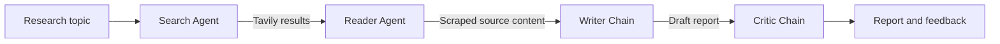

# Multi-Agent Research System

An open-source research assistant built with LangChain and Streamlit. Enter a topic and the application searches the web, extracts content from a relevant source, drafts a structured report, and critiques the result.

## Features

- Web research through the Tavily Search API
- Source extraction with `trafilatura`, `readability-lxml`, and BeautifulSoup fallbacks
- LLM-powered report writing and quality review
- Streamlit interface with pipeline progress and downloadable Markdown reports
- Command-line pipeline entry point for scripted runs

## Architecture

The system uses two tool-using agents followed by two LangChain chains:



1. **Search Agent** calls Tavily to find recent, relevant sources.
2. **Reader Agent** selects a source and calls the scraping tool to extract readable content.
3. **Writer Chain** combines the search results and extracted content into a report with findings, a conclusion, and source URLs.
4. **Critic Chain** scores the report and returns strengths, improvement areas, and a verdict.

The default language model is Groq's `llama-3.1-8b-instant`, configured in `src/agents/agents.py`.

## Technologies

- **Python** - application language
- **Streamlit** - interactive web UI
- **LangChain** and **LangChain Core** - agents, prompts, tools, and output chains
- **LangChain Groq** - Groq chat model integration
- **Tavily** - web search
- **Requests** - HTTP requests for source pages
- **Trafilatura**, **Readability**, **BeautifulSoup**, and **lxml** - content extraction
- **python-dotenv** - local environment configuration
- **Rich** - terminal logging

## Requirements

- Python 3.10 or newer
- A [Groq API key](https://console.groq.com/keys)
- A [Tavily API key](https://app.tavily.com/home)

## Installation

Clone the repository and create a virtual environment:

```bash
git clone <your-fork-or-repository-url>
cd Langchain-Multi-Agent-Research-System

python -m venv .venv
```

Activate the environment:

**Windows PowerShell**

```powershell
.\.venv\Scripts\Activate.ps1
```

**macOS/Linux**

```bash
source .venv/bin/activate
```

Install the dependencies:

```bash
python -m pip install --upgrade pip
python -m pip install -r requirements.txt
```

Create a `.env` file in the project root:

```dotenv
GROQ_API_KEY=your_groq_api_key
TAVILY_API_KEY=your_tavily_api_key
```

Keep `.env` private and never commit real API keys. Add it to `.gitignore` if it is not already ignored in your local checkout.
The repository already ignores `.env` by default.

## Usage

### Streamlit application

Run the interactive application:

```bash
streamlit run app.py
```

Then open the local URL shown by Streamlit, enter a research topic, and select **Run Research Pipeline**. The final report can be downloaded as a Markdown file.

### Python pipeline

For a non-UI run, edit the example topic in `main.py` or call the pipeline from your own script:

```python
from src.pipelines.pipeline import run_research_pipeline

result = run_research_pipeline("How will AI change software development?")
print(result["report"])
print(result["feedback"])
```

Run the included example with:

```bash
python main.py
```

## Project Structure

```text
.
├── app.py                    # Streamlit user interface
├── main.py                   # Example command-line entry point
├── requirements.txt          # Python dependencies
└── src/
	├── agents/agents.py      # Groq model, agents, writer, and critic chains
	├── pipelines/pipeline.py # Sequential research workflow
	└── tools/tools.py        # Tavily search and web scraping tools
```

## Notes and Limitations

- Search quality depends on Tavily results and the selected language model.
- Websites can block automated requests or return content that cannot be cleanly extracted.
- Generated reports should be checked against the linked sources before being used for important decisions.
- API usage may incur costs or rate limits according to the Groq and Tavily plans.

## Contributing

1. Create a feature branch.
2. Make focused changes and add tests where appropriate.
3. Run the application or relevant checks locally.
4. Open a pull request with a clear description of the change.

## License

This project is distributed under the terms of the [MIT License](LICENSE).
# Langchain-Multi-Agent-Research-System